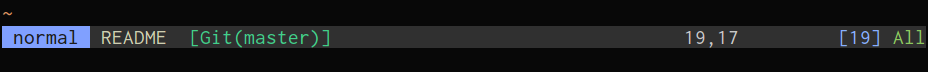
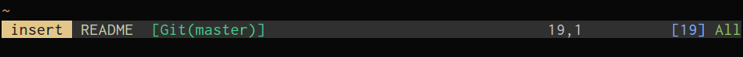
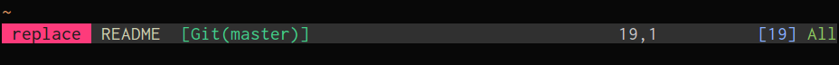
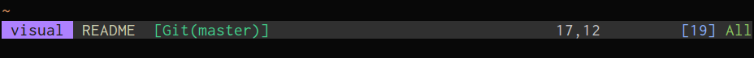

moonfly statusline
==================

*moonfly statusline* is a simple *statusline* for Vim and Neovim that uses
[moonfly](https://github.com/bluz71/vim-moonfly-colors) colors.

Screenshots
-----------

#### normal mode

#### insert mode

#### replace mode

#### visual mode

Dependency
----------

First install [moonfly](https://github.com/bluz71/vim-moonfly-colors)

Installation
------------

Use your favoured plugin manager to install **bluz71/vim-moonfly-statusline**.

If using [vim-plug](https://github.com/junegunn/vim-plug) do the following:

1. Add `Plug bluz71/vim-moonfly-statusline'` to your *vimrc*
2. Run `:PlugInstall`

License
-------

[MIT](https://opensource.org/licenses/MIT)
